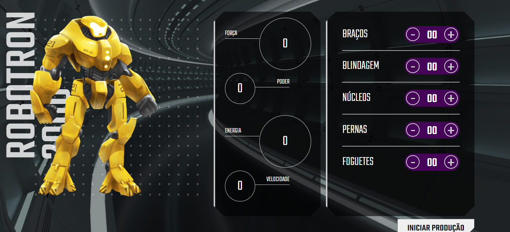

# ROBOTRON 2000

Projeto do curso <b>"JavaScript: manipulando o DOM"</b> da Alura, que consiste na criação de uma interface para produção de robôs do tipo Robotron 2000, <b>HTML, CSS e JavaScript</b>.

 

